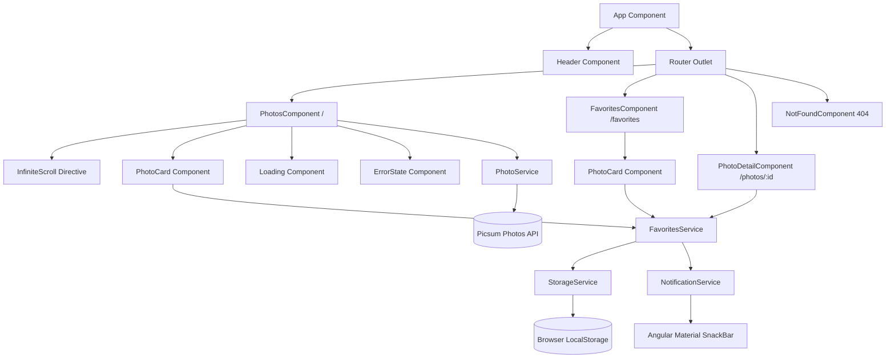
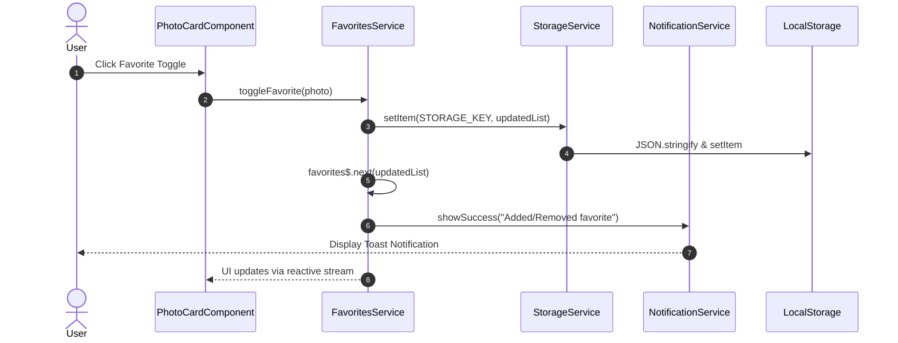

# 📸 Angular Gallery Application

[](https://angular.dev/)
[](https://www.typescriptlang.org/)
[](https://vitest.dev/)
[](https://material.angular.dev/)
[](https://rxjs.dev/)
[](https://prettier.io/)

> A modern, high-performance photo gallery application built with **Angular 22** standalone architecture. Designed with responsive aesthetics, reactive state management, infinite scrolling, persistent favorites caching, and a comprehensive **Vitest** test suite.

---

## 📑 Table of Contents

- [✨ Key Features](#-key-features)
- [🔬 Technical Highlights & Design Patterns](#-technical-highlights--design-patterns)
- [🏗️ Architectural Overview](#️-architectural-overview)
  - [Component & Service Hierarchy](#component--service-hierarchy)
  - [Reactive Data & Persistence Flow](#reactive-data--persistence-flow)
- [📂 Project Structure](#-project-structure)
- [🚀 Getting Started](#-getting-started)
  - [Prerequisites](#prerequisites)
  - [Installation](#installation)
  - [Environment Configuration](#environment-configuration)
- [💻 Development & Scripts](#-development--scripts)
  - [Dev Server](#dev-server)
  - [Unit Testing with Vitest](#unit-testing-with-vitest)
  - [Production Build](#production-build)
  - [Code Formatting](#code-formatting)
- [🧪 Testing Strategy](#-testing-strategy)

---

## ✨ Key Features

- **Infinite Photo Feed**: Smooth infinite scrolling fetching paginated photos dynamically from the Picsum API with custom aspect ratio constraints ($2:3$).
- **Reactive Favorites Management**: Instant bookmarking with optimistic UI updates and interactive toast notifications via Angular Material SnackBars.
- **Persistent Local Caching**: Favorites collection survives page refreshes via an abstracted, resilient `StorageService` leveraging browser `localStorage`.
- **Photo Detail Inspection**: Dedicated high-resolution detail view (`/photos/:id`) with smooth routing transitions and quick favorite removal controls.
- **Resilient Error & Loading UX**: Skeleton/shimmer loading indicators, customizable error boundary states with automated retry triggers, and a dedicated 404 page with route fallback.
- **Modern Responsive Layout**: Mobile-first CSS Grid and Flexbox layouts styled with custom SCSS and modern dark-mode aesthetic.

---

## 🔬 Technical Highlights & Design Patterns

### 1. Modern Angular 22 Architecture

- **100% Standalone Components**: Built without legacy NgModules for enhanced tree-shaking, cleaner dependency graphs, and faster compilation.
- **Lazy-Loaded Route Configuration**: Routes (`/`, `/favorites`, `/photos/:id`, `**`) utilize lazy imports (`loadComponent`) to optimize initial bundle size.
- **Modern Control Flow**: Uses native `@if`, `@for`, and `@switch` syntax for optimized DOM rendering.

### 2. Custom Infinite Scroll Directive (`appInfiniteScroll`)

- Implements resilient scroll height and threshold detection with event debouncing.
- Emits scroll-down events to trigger pagination while preventing duplicate concurrent fetches via request locking flags (`isLoading`).

### 3. Reactive State Management & Storage Abstraction

- Services utilize RxJS `BehaviorSubject` and `Observable` streams to broadcast state changes across components.
- `StorageService` provides a safe wrapper over `localStorage` with JSON serialization, error boundaries, and unit test mocking.

---

## 🏗️ Architectural Overview

### Component & Service Hierarchy



### Reactive Data & Persistence Flow



---

## 📂 Project Structure

```text
gallery/
├── public/                     # Static public assets
├── src/
│   ├── app/
│   │   ├── core/               # Shared & core singleton utilities
│   │   │   ├── components/     # Reusable UI components
│   │   │   │   ├── error-state/       # Generic error recovery view
│   │   │   │   ├── explore-button/    # Interactive CTA navigation
│   │   │   │   ├── header/            # Global navigation header
│   │   │   │   ├── loading/           # Skeleton & spinner indicators
│   │   │   │   ├── not-found/         # 404 route fallback view
│   │   │   │   └── photo-card/        # Card item with favorite action
│   │   │   ├── directives/     # Custom directives (e.g. infinite-scroll)
│   │   │   ├── models/         # TypeScript interfaces (Photo, etc.)
│   │   │   ├── rxjs/           # Custom RxJS operators and helpers
│   │   │   └── services/       # Core services (Photo, Favorites, Storage, Notification)
│   │   ├── features/           # Feature view modules
│   │   │   ├── favorites/      # Bookmarked photos gallery view
│   │   │   ├── photo-detail/   # Single photo high-res inspection view
│   │   │   └── photos/         # Main infinite photo stream view
│   │   ├── app.config.ts       # Application providers & router configuration
│   │   ├── app.routes.ts       # Application route definitions
│   │   ├── app.html            # Root shell layout
│   │   ├── app.scss            # Root shell styles
│   │   └── app.ts              # Root standalone component
│   ├── environments/           # Environment configuration files
│   │   ├── environment.ts             # Production environment
│   │   └── environment.development.ts # Development environment
│   ├── index.html              # HTML entry point
│   ├── main.ts                 # Application bootstrap entry point
│   └── styles.scss             # Global typography, resets, and theme tokens
├── angular.json                # Angular CLI & build pipeline configuration
├── package.json                # Dependencies and script definitions
├── tsconfig.json               # TypeScript configuration
├── vitest.config.ts            # Vitest unit test runner settings
└── README.md                   # Project documentation
```

---

## 🚀 Getting Started

### Prerequisites

- **Node.js**: `v20.x` or higher (LTS recommended)
- **npm**: `v11.x` or higher

### Installation

1. Clone the repository:

   ```bash
   git clone <repository-url>
   cd gallery
   ```

2. Install dependencies:
   ```bash
   npm install
   ```

### Environment Configuration

Environment settings are located in `src/environments/`:

```typescript
export const environment = {
  production: false,
  apiUrl: 'https://picsum.photos',
  pageSize: 18,
  imageRatio: {
    x: 2,
    y: 3,
  },
};
```

---

## 💻 Development & Scripts

| Command                  | Description                                                        |
| :----------------------- | :----------------------------------------------------------------- |
| `npm start` / `ng serve` | Runs the dev server on `http://localhost:4200/` with hot-reloading |
| `npm test` / `ng test`   | Executes unit tests using **Vitest** runner                        |
| `npm run build`          | Builds the application for production inside `dist/`               |
| `npm run watch`          | Builds in development mode and watches for file changes            |
| `npx prettier --write .` | Formats all source files according to Prettier rules               |

### Dev Server

```bash
npm start
```

Navigate to `http://localhost:4200/`. The app will automatically reload when source files are modified.

### Unit Testing with Vitest

Unit tests are powered by **Vitest** configured through `@angular/build:unit-test`.

```bash
npm test
```

### Production Build

```bash
npm run build
```

Build artifacts will be compiled into the `dist/` directory with production optimizations, script minification, and CSS budget enforcement.

### Code Formatting

To ensure consistent code formatting across the repository:

```bash
npx prettier --write .
```

---

## 🧪 Testing Strategy

The test suite covers unit and integration specs across all architectural layers:

- **Directives (`infinite-scroll.directive.spec.ts`)**: Verifies scroll boundary calculations, throttle thresholds, and event emission.
- **Services (`storage.service.spec.ts`, `notification.service.spec.ts`, `mock-favorites.service.spec.ts`)**: Validates state persistence, serialization, error recovery, and SnackBar triggering.
- **Components (`photos.component.spec.ts`, `photo-detail.component.spec.ts`, `favorites.component.spec.ts`, `app.spec.ts`)**: Verifies DOM rendering, route param consumption, mock data injection, and interaction events.
